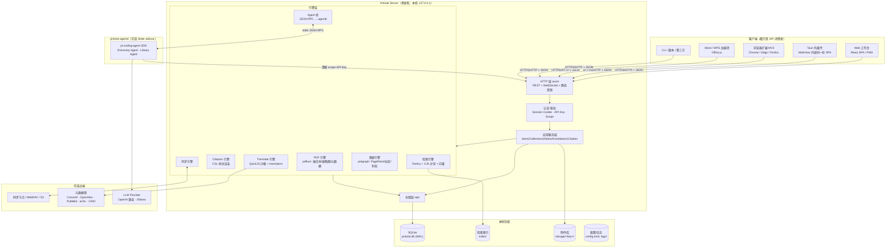

# 01 · 系统架构

## 1. 总体架构图



> Agent 层的完整设计见 [11-agents](11-agents.md)。核心约束：**`agentd` 是可选组件、独立进程、只能通过受限 scope 的公开 API 访问数据，且无权直接写入文献库**。

## 2. 进程模型

**单进程为主，无外部依赖**（不需要用户装 Node、Python、数据库）。

| 进程 | 说明 | 是否必须 |
| --- | --- | --- |
| `yinkote-server` | 核心服务：HTTP API + 所有引擎 + SQLite | ✅ 必须，开机自启 |
| `yinkote-tray`（Tauri） | 托盘图标、开机自启注册、自动更新、"打开工作台"、原生文件对话框 | 桌面端默认，Server 模式可不要 |
| `yinkote-agentd`（Node） | Agent 运行时：pi-coding-agent SDK + Yinkote 工具集 | ❌ 可选组件，懒启动、空闲自退 |
| 索引/OCR worker | 重活（PDF 抽文本、OCR、embedding）放在**同进程的独立线程池**，可选拆为 sidecar | 可选 |

> 设计原则：**Server 可独立运行**。放到 NAS / Linux 服务器上时，只跑 `yinkote-server`，Docker 一条命令起服务；桌面端只是多了一个托盘壳。

### 端口约定

| 端口 | 用途 |
| --- | --- |
| `23130` | Yinkote 主 API + Web UI（HTTP，仅绑定 127.0.0.1） |
| `23131` | 本地 HTTPS 端口（供 Office 加载项等强制 https 的宿主使用，见 08 文档） |
| `23119` | **可选**的 Zotero Connector 兼容端口；仅当检测到 Zotero 未运行时占用 |

## 3. 分层与模块职责

```
┌─ interface   HTTP 路由、DTO、序列化、WS 广播、静态文件服务
├─ application 用例编排、事务边界、领域事件、权限检查
├─ domain      实体与不变量：Item / Collection / Attachment / Annotation / Citation
├─ engines     可替换的能力实现（translate / citeproc / search / pdf / ai / sync）
└─ infra       SQLite 仓储、文件存储、HTTP 客户端、任务队列、配置、日志
```

**依赖方向严格向内**：`interface → application → domain`，`engines`/`infra` 通过 trait（接口）注入，便于测试与替换（例如检索引擎从 FTS5 换成 Tantivy 不影响上层）。

### 领域事件与实时推送

写操作在事务提交后发布领域事件 → 事件总线 → 两个订阅者：
1. **WebSocket 广播**：`{type:"item.updated", libraryId, key, version}`，前端做增量刷新（不是全量重拉）。
2. **异步任务队列**：索引重建、PDF 抽文本、缩略图、元数据补全、AI 打标签。任务持久化在 `tasks` 表，进程重启可恢复。

## 4. 任务队列设计

- 单表 `tasks(id, kind, payload, state, priority, attempts, run_after, error)`。
- 内置 worker 池（`tokio` 任务），按 `kind` 分配并发度：`pdf_extract=2`、`ai=1`、`fetch_metadata=4`。
- 幂等：每个 task 有 `dedup_key`，重复入队合并。
- 前端通过 `/api/v1/tasks` + WS 展示"正在处理 3 个附件"的进度条。

## 5. 仓库目录结构（monorepo）

```
yinkote/
├─ apps/
│  ├─ server/              # Rust 二进制入口（axum）
│  ├─ agentd/              # Node/TS Agent 运行时（pi-coding-agent SDK）
│  ├─ web/                 # React + TS 工作台（Vite）
│  ├─ desktop/             # Tauri v2 托盘壳
│  ├─ word-addin/          # Office.js 任务窗格（React）
│  └─ browser-ext/         # MV3 扩展（WXT）
├─ crates/
│  ├─ yk-core/             # domain + application
│  ├─ yk-store/            # sqlx 仓储 + migrations
│  ├─ yk-search/           # Tantivy / FTS5 封装 + 分词 + 向量
│  ├─ yk-translate/        # QuickJS 沙箱 + translators 运行时
│  ├─ yk-citeproc/         # CSL 引擎封装 + 样式/语言包管理
│  ├─ yk-pdf/              # pdfium 绑定：文本、页面渲染、大纲
│  ├─ yk-graph/            # 图谱构建、PageRank、Louvain、布局
│  ├─ yk-agent/            # agentd 进程管理 + JSON-RPC 桥 + workspace 物化
│  ├─ yk-sync/             # 同步协议实现
│  └─ yk-ai/               # LLM/Embedding Provider 抽象
├─ packages/
│  ├─ api-client/          # 由 OpenAPI 生成的 TS SDK（web/word/ext/agentd 共用）
│  ├─ ui/                  # 共享 React 组件（条目选择器等）
│  └─ schema/              # 条目类型 schema、CSL 类型定义（Rust/TS 共享 JSON）
├─ resources/
│  ├─ translators/         # 抓取脚本（见 10-licensing）
│  ├─ styles/              # CSL 样式
│  ├─ agent/               # Agent 系统提示词、Skills、AGENTS.md 模板
│  └─ locales/             # CSL 语言包 + UI i18n
├─ docs/
└─ tests/e2e/              # Playwright 端到端
```

工具链：**Cargo workspace + pnpm workspace**，用 `just` 或 `cargo xtask` 统一编排（`just dev` 同时起 server 热重载与 Vite）。

## 6. 关键架构决策

| 决策 | 选择 | 理由 |
| --- | --- | --- |
| 单体 vs 微服务 | **单体** | 本地软件，进程越少越好；模块化用 crate 边界保证 |
| 数据库 | **嵌入式 SQLite** | 零运维、单文件备份、WAL 下读写并发足够 |
| 前后端 | **前后端分离，同源部署** | Server 直接托管构建产物，避免 CORS 与端口困扰 |
| 客户端一致性 | **所有客户端走同一套公开 API** | 插件不是特权公民，dogfooding 保证 API 质量 |
| 离线能力 | **服务端本地优先** | 数据在本机，天然离线；网络仅用于抓取与同步 |
| 扩展机制 | **HTTP API + Webhook + 未来 WASM 插件** | 避免 Zotero 式的进程内 XPI 耦合 |
