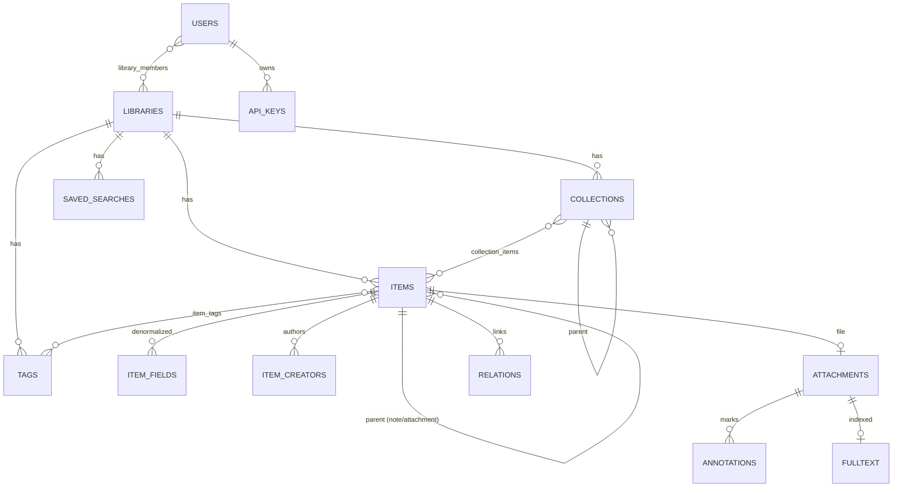

# 03 · 数据模型

## 1. 建模原则

1. **条目类型由 Schema 驱动**：不为每种文献类型建表。内置 `resources/schema/item-types.json`（参照 Zotero global schema 的形态：itemTypes → fields → creatorTypes，并给出到 CSL 类型的映射），前后端共用同一份，新增类型无需改表结构。
2. **规范存储 + 派生索引**：`items.data` 存完整 JSON（保真、可无损导入导出），同时把可检索字段拆到 `item_fields` / `item_creators`，兼顾灵活性与查询性能。
3. **版本化 + 软删除**：库级单调递增 `version`，每个对象携带 `version`；删除写入 `deletions` 表。这是增量同步、乐观锁、离线合并的基础（沿用 Zotero Web API 被验证过的模型）。
4. **key 与 id 分离**：`id` 是本地自增主键（快、内部用）；`key` 是 8 位大写随机串（跨库稳定、对外暴露、同步用）。
5. **一切皆 item**：笔记（note）、附件（attachment）、标注（annotation）都是 item 的子类型，可有父子关系 —— 使规则统一（都能打标签、都有版本、都能同步）。

## 2. ER 图



## 3. Schema（SQLite DDL 摘要）

```sql
-- ========== 库与权限 ==========
CREATE TABLE users (
  id            INTEGER PRIMARY KEY,
  username      TEXT NOT NULL UNIQUE,
  display_name  TEXT NOT NULL,
  password_hash TEXT NOT NULL,              -- argon2id
  created_at    INTEGER NOT NULL
);

CREATE TABLE libraries (
  id         INTEGER PRIMARY KEY,
  type       TEXT NOT NULL CHECK (type IN ('user','group')),
  name       TEXT NOT NULL,
  owner_id   INTEGER REFERENCES users(id),
  version    INTEGER NOT NULL DEFAULT 0,    -- 库级版本计数器
  created_at INTEGER NOT NULL
);

CREATE TABLE library_members (
  library_id INTEGER NOT NULL REFERENCES libraries(id) ON DELETE CASCADE,
  user_id    INTEGER NOT NULL REFERENCES users(id)     ON DELETE CASCADE,
  role       TEXT NOT NULL CHECK (role IN ('owner','editor','reader')),
  PRIMARY KEY (library_id, user_id)
);

-- ========== 收藏夹 ==========
CREATE TABLE collections (
  id         INTEGER PRIMARY KEY,
  library_id INTEGER NOT NULL REFERENCES libraries(id) ON DELETE CASCADE,
  key        TEXT NOT NULL,
  parent_id  INTEGER REFERENCES collections(id) ON DELETE CASCADE,
  name       TEXT NOT NULL,
  sort_index REAL NOT NULL DEFAULT 0,       -- 小数排序，插入无需重排兄弟节点
  version    INTEGER NOT NULL,
  deleted    INTEGER NOT NULL DEFAULT 0,
  UNIQUE (library_id, key)
);
CREATE INDEX idx_collections_parent ON collections(library_id, parent_id);

-- ========== 条目 ==========
CREATE TABLE items (
  id            INTEGER PRIMARY KEY,
  library_id    INTEGER NOT NULL REFERENCES libraries(id) ON DELETE CASCADE,
  key           TEXT NOT NULL,
  item_type     TEXT NOT NULL,              -- journalArticle | book | note | attachment | annotation ...
  parent_id     INTEGER REFERENCES items(id) ON DELETE CASCADE,
  data          TEXT NOT NULL,              -- JSON：完整字段（含少见字段、extra）
  date_added    INTEGER NOT NULL,
  date_modified INTEGER NOT NULL,
  version       INTEGER NOT NULL,
  deleted       INTEGER NOT NULL DEFAULT 0, -- 1 = 在回收站
  UNIQUE (library_id, key)
);
CREATE INDEX idx_items_lib_type   ON items(library_id, item_type, deleted);
CREATE INDEX idx_items_version    ON items(library_id, version);
CREATE INDEX idx_items_parent     ON items(parent_id);

-- 派生字段表：用于排序/筛选/精确匹配
CREATE TABLE item_fields (
  item_id INTEGER NOT NULL REFERENCES items(id) ON DELETE CASCADE,
  field   TEXT NOT NULL,                    -- title | date | DOI | publicationTitle ...
  value   TEXT NOT NULL,
  PRIMARY KEY (item_id, field)
) WITHOUT ROWID;
CREATE INDEX idx_item_fields_lookup ON item_fields(field, value);

CREATE TABLE item_creators (
  item_id      INTEGER NOT NULL REFERENCES items(id) ON DELETE CASCADE,
  ordinal      INTEGER NOT NULL,
  creator_type TEXT NOT NULL,               -- author | editor | translator ...
  field_mode   INTEGER NOT NULL DEFAULT 0,  -- 0=双字段(姓/名) 1=单字段(机构/中文姓名)
  last_name    TEXT NOT NULL,
  first_name   TEXT,
  PRIMARY KEY (item_id, ordinal)
) WITHOUT ROWID;
CREATE INDEX idx_creators_name ON item_creators(last_name, first_name);

CREATE TABLE collection_items (
  collection_id INTEGER NOT NULL REFERENCES collections(id) ON DELETE CASCADE,
  item_id       INTEGER NOT NULL REFERENCES items(id) ON DELETE CASCADE,
  sort_index    REAL NOT NULL DEFAULT 0,
  PRIMARY KEY (collection_id, item_id)
) WITHOUT ROWID;
CREATE INDEX idx_ci_item ON collection_items(item_id);

-- ========== 标签 ==========
CREATE TABLE tags (
  id         INTEGER PRIMARY KEY,
  library_id INTEGER NOT NULL REFERENCES libraries(id) ON DELETE CASCADE,
  name       TEXT NOT NULL,
  color      TEXT,                          -- 彩色标签（可置顶、可绑快捷键）
  position   INTEGER,
  UNIQUE (library_id, name)
);
CREATE TABLE item_tags (
  item_id INTEGER NOT NULL REFERENCES items(id) ON DELETE CASCADE,
  tag_id  INTEGER NOT NULL REFERENCES tags(id)  ON DELETE CASCADE,
  type    INTEGER NOT NULL DEFAULT 0,       -- 0=手动 1=自动(抓取/AI 生成)
  PRIMARY KEY (item_id, tag_id)
) WITHOUT ROWID;

-- ========== 附件 ==========
CREATE TABLE attachments (
  item_id       INTEGER PRIMARY KEY REFERENCES items(id) ON DELETE CASCADE,
  link_mode     TEXT NOT NULL,              -- imported_file | imported_url | linked_file | linked_url
  content_type  TEXT,                       -- application/pdf ...
  filename      TEXT,
  path          TEXT,                       -- 相对 library/ 的路径，由模板生成（见 14-storage-layout）
  path_dirty    INTEGER NOT NULL DEFAULT 0, -- 1 = 模板变更后待重组织 / 移动失败待修复
  url           TEXT,
  hash          TEXT,                       -- blake3；用于去重与同步
  size          INTEGER,
  storage_state TEXT NOT NULL DEFAULT 'local', -- local | remote_only | syncing | missing
  mtime         INTEGER,
  page_count    INTEGER,
  last_page     INTEGER,                    -- 阅读进度
  index_state   TEXT NOT NULL DEFAULT 'pending' -- pending|indexed|failed|unsupported
);

-- ========== 标注（PDF/EPUB） ==========
CREATE TABLE annotations (
  item_id       INTEGER PRIMARY KEY REFERENCES items(id) ON DELETE CASCADE,
  attachment_id INTEGER NOT NULL REFERENCES attachments(item_id) ON DELETE CASCADE,
  type          TEXT NOT NULL,              -- highlight|underline|note|image|ink|text
  color         TEXT,
  page_label    TEXT,
  sort_index    TEXT NOT NULL,              -- "00042|0001234|00089" 页|块|偏移，字典序即阅读序
  position      TEXT NOT NULL,              -- JSON: {pageIndex, rects[] | paths[]}
  text          TEXT,                       -- 选中的原文
  comment       TEXT,                       -- 用户批注
  author_name   TEXT,
  is_external   INTEGER NOT NULL DEFAULT 0  -- 来自 PDF 文件自带注释
);
CREATE INDEX idx_annot_att ON annotations(attachment_id, sort_index);

-- ========== 关系、检索、删除记录 ==========
CREATE TABLE relations (
  subject_item_id INTEGER NOT NULL REFERENCES items(id) ON DELETE CASCADE,
  predicate       TEXT NOT NULL,            -- dc:relation | owl:sameAs | dc:replaces
  object          TEXT NOT NULL,            -- item URI 或外部 URI
  PRIMARY KEY (subject_item_id, predicate, object)
) WITHOUT ROWID;

CREATE TABLE saved_searches (
  id         INTEGER PRIMARY KEY,
  library_id INTEGER NOT NULL REFERENCES libraries(id) ON DELETE CASCADE,
  key        TEXT NOT NULL,
  name       TEXT NOT NULL,
  conditions TEXT NOT NULL,                 -- JSON 条件树
  version    INTEGER NOT NULL,
  UNIQUE (library_id, key)
);

CREATE TABLE deletions (
  library_id  INTEGER NOT NULL,
  object_type TEXT NOT NULL,                -- item|collection|search|tag
  object_key  TEXT NOT NULL,
  version     INTEGER NOT NULL,
  deleted_at  INTEGER NOT NULL,
  PRIMARY KEY (library_id, object_type, object_key)
) WITHOUT ROWID;

-- ========== 系统 ==========
CREATE TABLE api_keys (
  id          INTEGER PRIMARY KEY,
  user_id     INTEGER NOT NULL REFERENCES users(id) ON DELETE CASCADE,
  name        TEXT NOT NULL,                -- "Chrome 扩展" / "Word 插件"
  key_hash    TEXT NOT NULL,                -- 只存哈希
  prefix      TEXT NOT NULL,                -- 前 8 位，便于 UI 展示与吊销
  scopes      TEXT NOT NULL,                -- JSON: ["items:read","items:write","files:read"]
  last_used   INTEGER,
  expires_at  INTEGER,
  revoked_at  INTEGER
);

CREATE TABLE tasks (
  id         INTEGER PRIMARY KEY,
  kind       TEXT NOT NULL,
  dedup_key  TEXT UNIQUE,
  payload    TEXT NOT NULL,
  state      TEXT NOT NULL DEFAULT 'queued', -- queued|running|done|failed
  priority   INTEGER NOT NULL DEFAULT 0,
  attempts   INTEGER NOT NULL DEFAULT 0,
  run_after  INTEGER NOT NULL DEFAULT 0,
  error      TEXT,
  updated_at INTEGER NOT NULL
);

CREATE TABLE settings (key TEXT PRIMARY KEY, value TEXT NOT NULL);
```

## 4. `items.data` JSON 形态

```jsonc
{
  "key": "A1B2C3D4",
  "version": 128,
  "itemType": "journalArticle",
  "title": "Attention Is All You Need",
  "creators": [
    { "creatorType": "author", "firstName": "Ashish", "lastName": "Vaswani" },
    { "creatorType": "author", "name": "国家自然科学基金委员会", "fieldMode": 1 }
  ],
  "publicationTitle": "NeurIPS",
  "date": "2017-06-12",
  "DOI": "10.48550/arXiv.1706.03762",
  "abstractNote": "...",
  "language": "en",
  "extra": "Citation Key: vaswani2017attention",
  "tags": [{ "tag": "transformer", "type": 1 }],
  "collections": ["QWERTY12"],
  "relations": { "dc:relation": ["yinkote://items/XYZ"] },
  "dateAdded": "2026-08-26T09:00:00Z",
  "dateModified": "2026-08-26T09:10:00Z"
}
```

CSL-JSON **不是**存储格式，而是由 `data` + schema 映射**派生**出来的（`crates/yk-citeproc/src/csl_map.rs`），保证：
- 导入/导出 BibTeX、RIS 的字段不丢失（放 `extra` 或类型专属字段）；
- 引文渲染始终基于标准 CSL-JSON。

## 5. 版本与并发控制

写操作事务内：
```sql
UPDATE libraries SET version = version + 1 WHERE id = ?;   -- 取得新版本 V
UPDATE items SET data=?, version=V, date_modified=? WHERE id=? AND version=?;  -- 乐观锁
```
- 客户端 PATCH 时带 `If-Unmodified-Since-Version: 127`；不匹配返回 `412 Precondition Failed`，前端弹出冲突合并界面。
- 增量拉取：`GET /items?since=100` → 返回 `version > 100` 的对象 + `deletions`。
- `Last-Modified-Version` 响应头返回当前库版本，客户端存下来作为下次 `since`。

## 6. 去重策略

判重优先级：`DOI` → `ISBN` → `PMID/arXivID` → `(标题归一化 + 首作者姓 + 年份)` → 附件 `blake3` 相同。
- 抓取入库前做 `POST /api/v1/items/duplicates/check`，命中则提示"合并到已有条目"。
- 库级"重复条目"虚拟视图，支持批量合并（保留主条目，子附件/标注/标签并入，建立 `owl:sameAs` 关系）。

## 7. 文件布局

> ⚠️ 本节为概要；**权威规范见 [14-storage-layout](14-storage-layout.md)**（自定义路径模板、sidecar 元数据、灾难恢复）。

```
$YINKOTE_DATA/                     # Win: %APPDATA%\Yinkote  macOS: ~/Library/Application Support/Yinkote  Linux: ~/.local/share/yinkote
├─ yinkote.db                      # SQLite（+ -wal, -shm）—— 权威索引
├─ config.toml
├─ library/                        # ⭐ 人可读的附件库，路径由模板决定
│  └─ 机器学习/Vaswani_2017_Attention Is All You Need/
│     ├─ Vaswani_2017_Attention Is All You Need.pdf
│     └─ .yinkote.json             # sidecar 元数据（自包含，可 git、可恢复）
├─ metadata/                       # 可选：全量元数据镜像
├─ agents/                         # pi 会话 JSONL、Skills、模型凭据
├─ agent-workspace/                # Agent 只读文件视图（cache 级）
├─ index/  vectors/                # Tantivy / 向量索引（可删，可重建）
├─ cache/                          # 缩略图、渲染页、翻译缓存
├─ styles/ locales/                # 用户额外安装的 CSL 样式
├─ backups/                        # 每日自动 DB 快照，保留 N 份
└─ logs/
```

> 设计要点：**`library/` + `yinkote.db` 就是全部数据**，直接打包即完成备份；`index/`、`vectors/`、`cache/`、`agent-workspace/` 可随时删除并自动重建。即使卸载 Yinkote，`library/` 仍是一份带可读文件名与 JSON 元数据的可用文献目录。

## 8. 扩展模块的表

以下模块的表结构在各自文档中定义，均遵循本文的建模原则（key/id 分离、版本化、软删除）：

| 模块 | 表 | 文档 |
| --- | --- | --- |
| Agent 会话与暂存区 | `agent_sessions`、`staged_candidates`、`agent_proposals` | [11-agents](11-agents.md) |
| 智能文献库 | `smart_libraries`、`smart_library_members` | [12-libraries-and-projects](12-libraries-and-projects.md) |
| 论文项目库 | `projects`、`project_items`、`project_outline`、`project_searches`、`project_fields` | [12](12-libraries-and-projects.md) |
| 收件箱 | `inbox_entries` | [12](12-libraries-and-projects.md) |
| 关系图谱 | `graph_nodes`、`graph_edges`、`graph_metrics` | [13-knowledge-graph](13-knowledge-graph.md) |
| RAG 分块 | `chunks`、`chunk_vec` | [06-search-and-pdf](06-search-and-pdf.md) |
