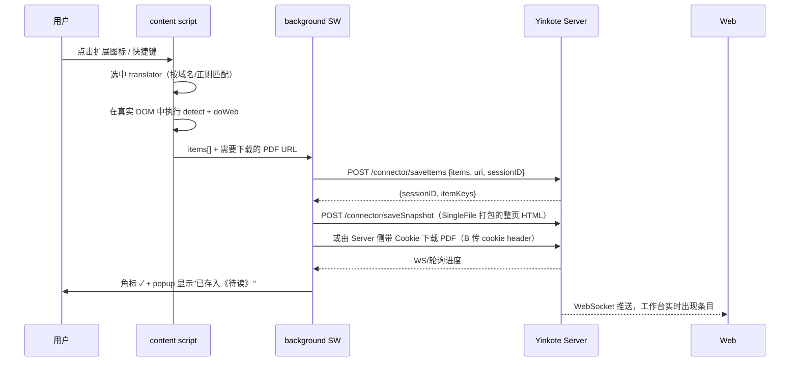
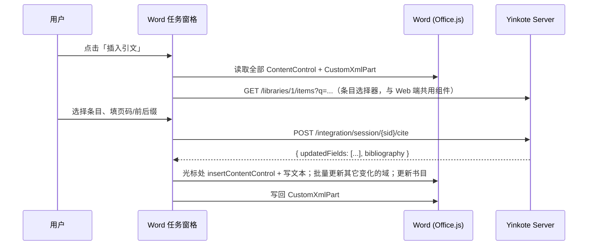

# 07 · 客户端集成（Word / WPS / 浏览器扩展）

> 核心原则：**插件没有特权**。它们是普通的 API 客户端，用 API Key 认证，走公开 REST。任何第三方都能写出等价插件。

## 1. 集成总览

| 客户端 | 传输 | 认证 | 主要职责 |
| --- | --- | --- | --- |
| 浏览器扩展 | `http://127.0.0.1:23130`（扩展 SW 直连） | API Key（配对码换取） | 抓取元数据、下载 PDF/快照、划词收藏 |
| Word / WPS 加载项 | `https://127.0.0.1:23131`（本地可信证书） | API Key | 插入/刷新引文、生成参考文献 |
| Web 工作台 | 同源 | Session Cookie | 全功能管理界面 |
| CLI / 脚本 | 本地 HTTP | API Key | 批处理、自动化、CI |

共享代码：`packages/api-client`（OpenAPI 生成的 TS SDK）与 `packages/ui`（条目选择器、样式选择器等组件）被 Web、Word 加载项、扩展 popup 三处复用。

## 2. 浏览器扩展

### 2.1 形态

- **框架**：WXT（基于 Vite），一套源码产出 Chrome/Edge（MV3）、Firefox（MV3/MV2 兼容）、Safari（可选）。
- **组成**：
  - `background`（Service Worker）：与本地 Server 通信、会话管理、右键菜单、快捷键
  - `content script`：页面元数据抽取（在真实 DOM 中执行 translator）、划词收藏
  - `popup`：保存目标（收藏夹/标签）、连接状态、最近保存
  - `options`：配对、服务器地址、行为偏好

### 2.2 与 Server 通信

```jsonc
// manifest.json 关键项
{
  "manifest_version": 3,
  "host_permissions": ["http://127.0.0.1:23130/*", "https://127.0.0.1:23131/*"],
  "permissions": ["storage", "contextMenus", "scripting", "activeTab", "downloads", "cookies"]
}
```
- 扩展的 Service Worker 发起的 `fetch` **不受网页的 Private Network Access 限制**，只要在 `host_permissions` 里声明即可直连 `127.0.0.1`；服务端还需允许扩展的 `Origin`（`chrome-extension://<id>`）进入 CORS 白名单。
- 服务端 CORS 策略：`Access-Control-Allow-Origin` 仅回显**已配对**的扩展 Origin，不用 `*`。

### 2.3 抓取流程（含"真 DOM"优势）



关键细节：
- **PDF 需要机构订阅 Cookie**：由扩展带页面 Cookie 下载后 `POST /items/{key}/file` 上传，而不是让 Server 裸抓（Server 没有用户的登录态）。
- **抓取会话**：`sessionID` 让用户在保存后 5 秒内还能改收藏夹/加标签（`POST /connector/updateSession`）。
- **降级链**：站点 translator → 通用 `Embedded Metadata`（Highwire/DC/OG meta 标签） → 页面 DOI 识别 → 保存网页快照为 `webpage` 条目。

### 2.4 Zotero Connector 兼容模式

Server 可选监听 `23119` 并实现 `/connector/*` 报文形状 → **官方 Zotero Connector 可直接把文献存进 Yinkote**。
- 仅在检测到本机 Zotero 未运行时占用该端口，避免冲突（启动时尝试绑定，失败则跳过并在 UI 说明）。
- 价值：新用户零成本试用；风险与合规见 [10-licensing](10-licensing.md)。

### 2.5 目标站点适配优先级（中文场景）

`arXiv` · `Crossref/DOI 通用` · `PubMed` · `IEEE Xplore` · `ACM DL` · `Springer` · `ScienceDirect` · `Nature` · `Google Scholar` · **`知网 CNKI`** · **`万方`** · **`维普`** · **`中国知网学位论文`** · `豆瓣读书（图书）` · `国家标准全文公开系统`

---

## 3. Word 加载项

### 3.1 技术选型

**Office.js 加载项（Office Add-in）**，而非 VSTO / COM。

| 维度 | Office.js | VSTO(COM) |
| --- | --- | --- |
| 平台 | Windows / macOS / Word Web / iPad | 仅 Windows |
| 分发 | AppSource 或旁加载（清单 XML） | 安装包 + 注册表 |
| 技术 | HTML/JS，可与 Web 工作台复用组件 | .NET |
| 能力 | 内容控件、CustomXmlPart、OOXML 读写 | 完整 COM，含"域(Field)" |
| 结论 | **✅ 选它**（跨平台是硬需求） | 仅在需要真·Word 域时作为 Windows 增强 |

### 3.2 引文在文档中的表示

Zotero 用 Word **域（Field）**存引文；Office.js 不能创建域，但有等价物：

```
每条引文 = 一个 ContentControl
  ├ tag   : "YINKOTE_CITATION_<uuid>"     ← 索引用，短
  ├ title : "Yinkote Citation"
  └ 正文  : 渲染后的引文文本，如 "(Vaswani et al., 2017)"

参考文献表 = 一个 ContentControl  tag: "YINKOTE_BIBL"

文档级数据 = CustomXmlPart (namespace: urn:yinkote:doc:1)
  {
    "version": 1,
    "prefs": { "styleId": "gb-t-7714-2015", "locale": "zh-CN",
               "fieldType": "ContentControl", "bibliographyStyleHasBeenSet": true,
               "noteType": 0, "automaticJournalAbbreviations": false },
    "citations": {
      "<uuid>": { "citationItems": [ { "key":"A1B2C3D4", "libraryId":1,
                                       "locator":"12", "label":"page",
                                       "prefix":"见 ", "suffix":"",
                                       "suppressAuthor": false,
                                       "itemData": { /* CSL-JSON 快照 */ } } ],
                  "properties": { "unsorted": false } }
    },
    "customBibliography": { "<itemKey>": "<用户手改过的条目 HTML>" }
  }
```

设计理由：
- ContentControl 的 `tag` 长度有限且会被用户误编辑，**不适合**塞完整 JSON（Zotero 早期把 JSON 塞进域代码带来了体积和兼容问题）；用 uuid 索引到 CustomXmlPart 更稳。
- `itemData` 存 CSL-JSON **快照**：即使论文换电脑、Yinkote 库里条目被删，文档依然可以正确重排 —— 这是 Zotero 的关键设计，必须保留。
- 兼容目标：能读取 Zotero 生成的 `ADDIN ZOTERO_ITEM CSL_CITATION {...}` 域，从而**接管已有 Zotero 论文**（读 OOXML 的 `w:fldSimple`/`w:instrText`）。这是极强的迁移卖点。

### 3.3 集成会话协议

任务窗格与 Server 的交互（`/api/v1/integration/*`）：

```
POST /integration/session
     { docId, docPrefs? }                 → { sessionId, prefs }
POST /integration/session/{sid}/cite
     { citation?: {...}, fieldsSnapshot: [ {id, text, citation} ] }
     → { updatedFields: [ {id, text} ], bibliography? }
POST /integration/session/{sid}/refresh
     { fieldsSnapshot }                    → 全量重算（编号型样式需要全局重排）
POST /integration/session/{sid}/bibliography
     { fieldsSnapshot }                    → { html, entries[] }
PUT  /integration/session/{sid}/prefs
     { styleId, locale, ... }              → 触发全量刷新
POST /integration/session/{sid}/close
```

> **实现状态**：本节协议已在 `crates/yk-server/src/integration/` 落地。
> 编号与重排的全部逻辑是纯函数 `integration::document::plan`（无 store、无 HTTP），
> 单元测试覆盖"插入引文导致重排""同一文献重复引用共号""缺失条目不占号"
> "作者-年份书目按渲染结果排序""定位符落在括号内"等；端到端由 `scripts/smoke.sh`
> 的 `word integration` 一节覆盖。加载项前端见下节 3.3.1。
>
> 两点实现时才暴露的约束：
> 1. **`docPrefs` 缺省 ≠ 使用默认值。** 加载项重连时不带偏好，若用默认值填补，
>    一篇 IEEE 论文会被静默改写成 APA。缺省表示"我没什么要告诉你"。
> 2. **缺失的条目不能占用编号。** 否则正文出现 `[2]` 而书目从 `[1]` 开始，
>    两边对不上；被删掉的文献保留文档原文，不清空——清空是作者找不回来的破坏。

### 3.3.1 任务窗格由服务端托管

窗格是 `crates/yk-server/src/addin/`：三个内嵌静态文件（`taskpane.html/js/css`）、
按请求生成的清单、以及现算的图标。四个决定：

1. **清单必须生成，不能作为静态文件签入。** Office 不做任何相对解析——清单里每个
   URL 都是绝对的，因此文件里必须写着本机*实际*监听的主机与端口。端口可配置，
   于是 `origin_from()` 取请求的 `Host`：从 `localhost` 取到的清单必须写
   `localhost`，因为 Office 豁免 HTTPS 的规则正是按这个字面名字写的。
   带引号或空格的 `Host` 一律拒绝而非转义——那是攻击，不是主机名。
2. **加载项 id 必须跨重启稳定。** Word 用清单里的 GUID 标识旁加载的加载项，
   每次启动新生成一个，作者的功能区里就会堆满一排功能相同的按钮。id 只生成一次，
   存在 settings 的 `integration.addinId`。
3. **资源内嵌进二进制，且必须绕开 SPA fallback。** 否则 `manifest.xml` 会被
   `index.html` 应答——合法的 HTML、非法的其它一切，而 Word 给出的报错不指向任何
   可行动的东西。路由因此挂在 `/api/v1` 之外、fallback 之前。
4. **窗格自己不排版。** 它只上传全部域、写回服务端给的文本。编号型样式下
   "只更新这一条"永远是错的（见下），所以插入、刷新、换样式在窗格里是同一条代码路径。

窗格把每条引文放进一个 ContentControl，引文本身存在
`Office.context.document.settings`（随 .docx 走），因此换台机器打开文件，引文依然
知道自己引的是什么——这正是服务端不必记录任何文档的原因。

安装入口在「设置 › Word 插件」：下载清单 + 复制旁加载目录，目录按 UA 猜测平台。

**为什么是"快照上传 + 全量返回"**：编号型样式（IEEE、GB/T 7714 顺序编码制）中插入一条引文会改变后续所有编号，服务端必须看到全文所有引文才能正确渲染。加载项负责读出所有 ContentControl 的 id 顺序，Server 负责 citeproc 计算并返回每个 id 的新文本。

### 3.4 插入引文的用户流程



性能：一次 `Word.run` 内批量操作 + 单次 `context.sync()`；只更新**文本发生变化**的 ContentControl（diff），万字论文百条引文刷新目标 < 1.5s。

### 3.5 关键技术风险：Office 加载项访问 localhost

Office 加载项运行在 `https://` 的 WebView 中，直接 `fetch("http://127.0.0.1:...")` 会被**混合内容**策略阻断。三种解法：

| 方案 | 做法 | 优劣 |
| --- | --- | --- |
| **A. 本地可信 HTTPS（推荐）** | 安装时用 `rcgen` 生成本地 CA + `127.0.0.1` 证书，写入系统信任库（Win: CertMgr；mac: Keychain；Linux: `/usr/local/share/ca-certificates`）。加载项访问 `https://127.0.0.1:23131` | 体验最好；需要一次提权，且必须妥善保管私钥（仅本机生成、不出网、权限 600） |
| **B. 公共域名回环** | 注册 `local.yinkote.app` 解析到 `127.0.0.1`，用公开签发证书 | 证书私钥必须随客户端分发 = 泄露，**不采纳** |
| **C. 中继/剪贴板降级** | 加载项通过 Office Dialog API 打开 `http://127.0.0.1` 的对话框窗口（独立浏览上下文，不受任务窗格混合内容限制），用 `messageParent` 回传数据 | 兜底可用，交互略笨重；**作为 A 失败时的自动降级** |

决策：**A 为主，C 为兜底**，安装向导中明确解释证书用途，并提供"卸载时移除 CA"。

### 3.6 其它写作端

| 目标 | 方案 | 优先级 |
| --- | --- | --- |
| **WPS 文字** | WPS 加载项（JS API，与 Office.js 相似但需适配）；中文用户占比高 | 高（V1.0） |
| **LibreOffice** | UNO 扩展（Python/Java），复用同一套 `/integration` 协议 | 中 |
| **Google Docs** | 浏览器扩展注入 + Docs API（走扩展通道，无需本地 HTTPS） | 中 |
| **Markdown / LaTeX** | 导出 `.bib`（可配置 citekey 规则，自动增量导出到指定路径，供 Pandoc/LaTeX 使用） | 高（成本极低） |
| **Obsidian / Logseq** | 社区插件调用 REST API + 模板化笔记导出 | 低（可由社区实现） |
| **Typst** | 导出 `.yml` 书目 | 低 |

---

## 4. CLI

`yinkote` CLI（同一 Rust 仓库的第二个 bin）：
```
yinkote add 10.1038/nature12373 --collection 待读
yinkote search "扩散模型" --fulltext --limit 20
yinkote export --collection 综述 --format bibtex > refs.bib
yinkote serve --port 23130 --data-dir ./data
yinkote import zotero ~/Zotero
```
CLI 通过本地 API 工作（不直连数据库），从而与其它客户端共享同一份并发控制与业务规则。
