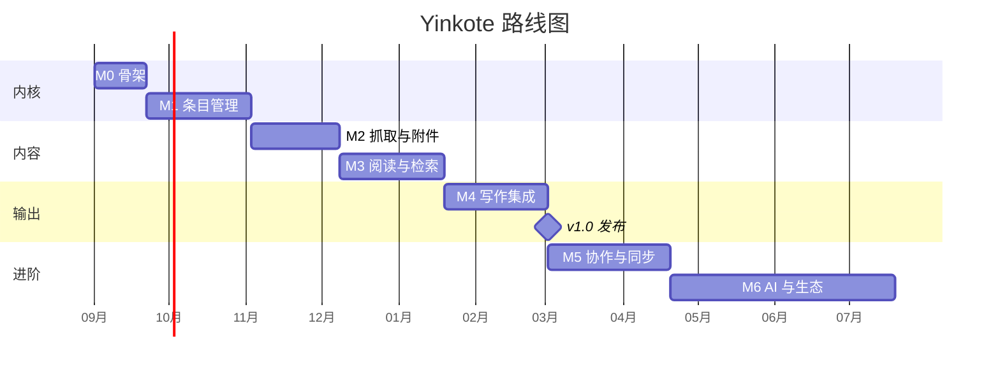

# 09 · 技术路线与里程碑

## 1. 演进策略

> **先把"能替代 Zotero 的最小闭环"跑通，再谈差异化。**

闭环定义：**抓得进来 → 读得舒服 → 找得到 → 引得出去**。任何不服务于这条链路的功能都往后排。

同时贯彻两条工程原则：
1. **接口先行**：每个引擎（search / translate / citeproc / pdf / sync / ai）先定义 trait，MVP 用最简实现，后期无痛替换。
2. **数据不可丢**：从 M1 起就有版本号、软删除、自动备份、导出全量的能力。

## 2. 里程碑

### M0 · 骨架（2–3 周）
- Cargo + pnpm monorepo，CI 矩阵构建
- axum 起服务、SQLite 迁移、`/ping`、静态托管 SPA
- 认证：本地用户 + Session + API Key + 配对码
- Tauri 托盘壳（打开工作台、退出、自启）
- **验收**：`yinkote serve` 后浏览器能登录看到空库；三平台安装包可产出

### M1 · 条目管理内核（4–6 周）
- schema 驱动的条目类型；Items/Collections/Tags/Notes CRUD + 版本号 + 回收站
- Web 三栏工作台：收藏夹树 / 虚拟滚动条目表 / 详情编辑器
- 富文本笔记（TipTap）
- 导入导出：BibTeX / RIS / CSL-JSON
- **Zotero 数据目录一键迁移**（这是获客关键，必须早做）
- WebSocket 实时刷新
- **验收**：能把一个 5000 条目的 Zotero 库完整迁进来并流畅浏览编辑

### M2 · 抓取与附件（4–5 周）
- 附件存储、上传/下载/Range、去重、缩略图
- 标识符查询：DOI(Crossref) / arXiv / PubMed / ISBN / OpenAlex
- 浏览器扩展 v1：MV3 + 配对 + `Embedded Metadata` 通用抓取 + PDF/快照保存
- Zotero Connector 兼容端口（可选开关）
- 中文站点适配：知网 / 万方 / 维普
- **验收**：从 5 个主流站点 + 3 个中文站点一键入库成功率 > 90%

### M3 · 阅读与检索（5–6 周）
- pdf.js 阅读器 + 标注层（高亮/下划线/批注/区域/墨迹）
- 标注 API、从标注生成笔记、标注全文可搜
- 服务端 PDF 文本抽取（pdfium）+ 全文索引（先 FTS5，再切 Tantivy + lindera）
- 高级检索 / 保存的检索 / 标签筛选
- **验收**：10 万文档全文检索 p95 < 200ms；中文检索召回可用

### M4 · 写作集成（4–6 周）
- citeproc 引擎（QuickJS + citeproc-js）、样式与 locale 管理
- 快速复制引文/参考文献（含 Markdown）
- 本地可信 HTTPS + 证书安装流程
- **Word 加载项**：插入/编辑引文、参考文献、切换样式、刷新、Unlink；读取 Zotero 遗留域
- 自动导出 `.bib`（LaTeX/Pandoc 用户）
- **验收**：一篇含 100 条引文的论文在 Win/Mac Word 上切换样式全量刷新 < 2s，GB/T 7714 输出与 Zotero 逐字一致

### 🎯 v1.0 = M0–M4（约 5–6 个月，3–4 人）

### M5 · 协作与同步（5–7 周）
- 多用户、群组库、角色权限
- Hub 同步节点 + WebDAV + S3 后端；三方合并与冲突 UI
- 可选端到端加密
- 按需下载附件
- **验收**：两台机器交替离线编辑同一条目，无数据丢失，冲突可视化可解

### M6 · AI 与生态（持续）
- 摘要 / 自动标签 / 翻译 / Chat with PDF / 语义检索（本地与云双通道）
- 参考文献文本解析、去重与合并向导
- WPS 加载项、LibreOffice 扩展、Google Docs
- PWA 移动端、离线只读
- 插件市场（WASM 插件 + Webhook）

## 3. 甘特概览

## 4. 团队与分工建议（3–4 人）

| 角色 | 职责 |
| --- | --- |
| Rust 后端 ×1.5 | Server、引擎层、同步、打包 |
| 前端 ×1.5 | Web 工作台、阅读器、扩展 popup |
| 全栈/集成 ×1 | 浏览器扩展、Word 加载项、CLI、E2E |

若只有 1–2 人：把 M2 的中文站点适配、M5 全部、M6 全部延后，优先交付 M0–M4 的"单机可用版"。

## 5. 风险登记册

| # | 风险 | 影响 | 概率 | 应对 |
| --- | --- | --- | --- | --- |
| R1 | translators 在 QuickJS 沙箱兼容性差 | 抓取能力受损（核心功能） | 高 | 优先在扩展的真实 DOM 中执行；服务端只做 HTTP/API 类抓取；自研 20 个高频站点解析器兜底 |
| R2 | Office 加载项无法访问本地服务 | Word 集成不可用 | 中 | 本地可信 CA（方案 A）+ Dialog API 中继（方案 C）双保险，M0 就做技术验证 |
| R3 | AGPL 组件（translators / Zotero reader）带来的合规约束 | 商业化受限 | 中 | 项目本体采用 AGPL-3.0；若需宽松许可则自研替代，见 10-licensing |
| R4 | 引文输出与 Zotero 不一致导致用户不信任 | 口碑致命 | 中 | 直接用 citeproc-js；引入 CSL 官方测试集做回归门禁 |
| R5 | 中文检索效果不达预期 | 目标用户流失 | 中 | 早期就用 Tantivy+lindera 做基准评测，准备词典热更新与拼音检索 |
| R6 | 大库性能（10 万+条目、100GB 附件） | 卡顿 | 中 | 从 M1 起就用合成大库做性能回归；虚拟滚动 + 游标分页 + 按需下载 |
| R7 | 用户数据丢失（迁移/同步 bug） | 不可挽回 | 低但致命 | 迁移只读源库、自动备份、软删除、同步冲突绝不静默覆盖、灾难恢复文档 |
| R8 | macOS 签名公证 / Windows SmartScreen | 安装劝退 | 高 | 早买开发者证书与 EV 代码签名；提供 Homebrew/winget 渠道 |
| R9 | Zotero Connector 兼容被上游变更打破 | 冷启动路径失效 | 中 | 兼容层仅作锦上添花，自有扩展为主路径 |

## 6. 技术验证清单（M0 之前的 Spike，每项 ≤ 3 天）

- [ ] `rquickjs` 跑通一个真实 Zotero translator（需要多少 DOM API？）
- [ ] `rquickjs` 跑通 citeproc-js 渲染 GB/T 7714，与 Zotero 输出 diff
- [ ] Office.js 任务窗格访问本机自签 HTTPS 服务（Win + Mac + Word Web 三处实测）
- [ ] Office.js ContentControl + CustomXmlPart 承载 100 条引文的读写性能
- [ ] MV3 Service Worker fetch `127.0.0.1` 在 Chrome/Edge/Firefox 的实际限制
- [ ] Tantivy + lindera 中文检索效果与索引体积基准
- [ ] `pdfium-render` 在三平台的交叉编译与体积
- [ ] Tauri v2 托盘 + 自启 + 更新器三平台打通
