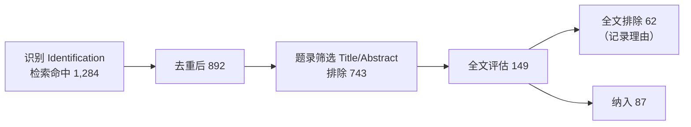

# 12 · 智能文献库与论文项目库

## 0. 四层组织模型

Yinkote 把"文献的组织"分成四层，逐层增强，互不冲突：

| 层 | 名称 | 成员如何确定 | 典型用途 |
| --- | --- | --- | --- |
| L0 | **收藏夹 Collection** | 手动拖拽 | 我自己的分类习惯 |
| L1 | **保存的检索 Saved Search** | 规则树，实时求值 | "近三年 + 标签=LLM + 未读" |
| L2 | **智能文献库 Smart Library** | 规则树 **+ 语义/AI 谓词 + 种子文献扩散**，可持久化成员、可增量维护 | "所有和扩散模型分子生成相关的文献" |
| L3 | **论文项目库 Project** | 以**一篇在写的论文**为单位，聚合文献 + 筛选状态 + 大纲 + 引文 + 产出 | "我的 NeurIPS 投稿" |

> 关于"以论文为单位的文献库"，本设计给出**两种解读，且都实现**：
> - **写作视角**（L3 Project）：以"我正在写的论文"为单位 —— 主形态。
> - **种子视角**（L2 的一种预设）：以"某一篇 seed 论文"为核心，自动生成其引用网络构成的文献库 —— 见 §2.4「论文中心库」。

---

## 1. 保存的检索（L1）

已在 [03-data-model](03-data-model.md) 定义 `saved_searches`。特点：**无状态、实时求值、零维护**。条件树支持 `all/any/none` 嵌套，字段涵盖元数据、标签、附件、笔记、全文、阅读状态、添加时间。

---

## 2. 智能文献库（L2）

### 2.1 与 L1 的本质区别

| | 保存的检索 | 智能文献库 |
| --- | --- | --- |
| 成员 | 每次打开重新算 | **物化**（存 `smart_library_members`），可人工增删并被记住 |
| 判据 | 只有确定性规则 | 规则 **+ 向量相似 + AI 自然语言谓词** |
| 维护 | 无 | 后台增量：新条目入库时自动评估是否纳入 |
| 可解释 | 不需要 | 每个成员都有 `reason` 与 `score`，可追问"为什么它在这里" |
| 反馈 | 无 | 用户"踢出/钉住"会作为负/正样本改进阈值（`pinned` / `excluded`） |

### 2.2 定义（`smart_libraries.definition` JSON）

```jsonc
{
  "name": "扩散模型 · 分子生成",
  "mode": "hybrid",                 // rules | semantic | seeds | hybrid
  "rules": {                        // 硬过滤（必须满足）
    "op": "all",
    "conditions": [
      { "field": "date", "op": "isInTheLast", "value": "5 years" },
      { "field": "itemType", "op": "isNot", "value": "webpage" }
    ]
  },
  "semantic": {                     // 语义召回
    "query": "使用扩散模型 / 流匹配进行三维分子构象与药物分子生成",
    "threshold": 0.62,
    "topK": 500
  },
  "seeds": {                        // 种子扩散（引文网络）
    "itemKeys": ["A1B2C3D4", "E5F6G7H8"],
    "expand": ["references", "citations", "cocitation"],
    "depth": 1,
    "minSharedRefs": 2              // 文献耦合阈值
  },
  "aiPredicate": {                  // 昂贵，仅对通过前几关的候选跑
    "prompt": "这篇论文是否提出或显著改进了分子生成的生成式模型？只回答 yes/no + 一句理由。",
    "model": "cheap",
    "enabled": true
  },
  "autoIngest": {                   // 是否自动去外部找新文献
    "enabled": true,
    "schedule": "weekly",
    "target": "inbox"               // inbox = 进收件箱待确认，不直接入库
  }
}
```

**求值流水线**（成本从低到高，逐级收敛）：
```
硬规则过滤 → BM25/向量召回 → 引文网络扩散 → 打分排序 → (可选) AI 谓词复核 → 物化成员
```

### 2.3 表结构

```sql
CREATE TABLE smart_libraries (
  id           INTEGER PRIMARY KEY,
  library_id   INTEGER NOT NULL REFERENCES libraries(id) ON DELETE CASCADE,
  key          TEXT NOT NULL,
  name         TEXT NOT NULL,
  parent_id    INTEGER REFERENCES collections(id),   -- 可挂在收藏夹树上显示
  definition   TEXT NOT NULL,                        -- 上面的 JSON
  last_eval_at INTEGER,
  eval_state   TEXT NOT NULL DEFAULT 'idle',         -- idle|running|error
  version      INTEGER NOT NULL,
  UNIQUE (library_id, key)
);

CREATE TABLE smart_library_members (
  smart_library_id INTEGER NOT NULL REFERENCES smart_libraries(id) ON DELETE CASCADE,
  item_id          INTEGER NOT NULL REFERENCES items(id) ON DELETE CASCADE,
  score            REAL,
  reason           TEXT,          -- 可解释：命中规则 / 语义相似 / 被 X 引用
  origin           TEXT NOT NULL, -- rule|semantic|seed|ai|manual
  pinned           INTEGER NOT NULL DEFAULT 0,  -- 用户钉住：永远保留
  excluded         INTEGER NOT NULL DEFAULT 0,  -- 用户踢出：永远排除
  added_at         INTEGER NOT NULL,
  PRIMARY KEY (smart_library_id, item_id)
) WITHOUT ROWID;
```

### 2.4 论文中心库（Paper-centric Library）

一键从任意条目创建：**「以这篇论文为中心建库」**。

```
seeds = [该论文]
expand = references(向后) + citations(向前) + cocitation(共被引) + similar(语义)
```
产出一个自带图谱视图的智能库，回答"这篇论文的知识谱系是什么"：它站在谁的肩膀上、谁在跟进、谁在反驳、同期竞品是谁。这是读一篇新论文时最高频的需求，也是与 [13-knowledge-graph](13-knowledge-graph.md) 的天然结合点。

### 2.5 增量维护

- 新条目入库 / 元数据更新 → 事件 → 只对**受影响的**智能库做单条评估（不全量重算）。
- 定义变更 / 定时任务 → 全量重算，产出 diff（新增 N 条、移除 M 条）供用户复核，不静默变更。
- `autoIngest` 开启时，定时触发 Discovery Agent 按 `semantic.query` 去外部检索 → 结果进**收件箱**（`inbox_entries`），用户确认后入库。

---

## 3. 论文项目库（L3 · Project）

### 3.1 它是什么

一个 Project = **一篇在写的论文的全部上下文**：

```
📄 Project：《扩散模型用于分子生成的综述》
├─ 📚 文献池          纳入 87 篇 / 排除 143 篇 / 待筛 22 篇
├─ 🔎 检索记录        6 次检索（含检索式、日期、命中数）← 可导出 PRISMA
├─ 🏷 自定义字段      每篇论文打：方法类别 / 数据集 / 主要指标 / 我的评价
├─ 🗂 大纲            1 引言 / 2 背景 / 3 方法分类 / 3.1 …（每节挂着该节要引的文献）
├─ 📝 笔记与草稿      项目级笔记、每节草稿
├─ 🔗 关联文档        ~/papers/survey.docx（Word 插件里当前文档）
├─ 🎨 引用样式        目标期刊样式 + 语言
└─ 📤 产出            refs.bib（自动增量导出）/ 参考文献表 / 检索报告 / 对比表
```

### 3.2 表结构

```sql
CREATE TABLE projects (
  id             INTEGER PRIMARY KEY,
  library_id     INTEGER NOT NULL REFERENCES libraries(id) ON DELETE CASCADE,
  key            TEXT NOT NULL,
  name           TEXT NOT NULL,
  kind           TEXT NOT NULL DEFAULT 'paper',  -- paper|survey|thesis|grant|systematic-review
  description    TEXT,
  style_id       TEXT,                            -- 目标期刊 CSL 样式
  locale         TEXT,
  bib_export_path TEXT,                           -- 自动导出 .bib 的路径（LaTeX 用户）
  doc_refs       TEXT,                            -- JSON：关联的 Word/LaTeX 文档路径与 docId
  state          TEXT NOT NULL DEFAULT 'active',  -- active|submitted|published|archived
  deadline       INTEGER,
  version        INTEGER NOT NULL,
  UNIQUE (library_id, key)
);

CREATE TABLE project_items (
  project_id  INTEGER NOT NULL REFERENCES projects(id) ON DELETE CASCADE,
  item_id     INTEGER NOT NULL REFERENCES items(id) ON DELETE CASCADE,
  -- 筛选流程（对齐 PRISMA）
  screening   TEXT NOT NULL DEFAULT 'candidate', -- candidate|screened|included|excluded
  exclude_reason TEXT,
  -- 阅读与写作状态
  read_state  TEXT NOT NULL DEFAULT 'unread',    -- unread|skimmed|read|deep
  priority    INTEGER NOT NULL DEFAULT 0,
  section     TEXT,                              -- 归到大纲哪一节，如 "3.1"
  extraction  TEXT,                              -- JSON：自定义字段抽取结果
  my_note     TEXT,                              -- 一句话评价
  added_by    TEXT NOT NULL DEFAULT 'user',      -- user|agent|smart
  added_at    INTEGER NOT NULL,
  PRIMARY KEY (project_id, item_id)
) WITHOUT ROWID;

CREATE TABLE project_outline (
  id         INTEGER PRIMARY KEY,
  project_id INTEGER NOT NULL REFERENCES projects(id) ON DELETE CASCADE,
  parent_id  INTEGER REFERENCES project_outline(id) ON DELETE CASCADE,
  number     TEXT NOT NULL,        -- "3.1"
  title      TEXT NOT NULL,
  content    TEXT,                 -- 草稿（TipTap JSON）
  sort_index REAL NOT NULL
);

CREATE TABLE project_searches (       -- 检索留痕，PRISMA 可复现
  id         INTEGER PRIMARY KEY,
  project_id INTEGER NOT NULL REFERENCES projects(id) ON DELETE CASCADE,
  source     TEXT NOT NULL,           -- openalex|pubmed|cnki|…
  query      TEXT NOT NULL,
  filters    TEXT,
  hits       INTEGER NOT NULL,
  new_items  INTEGER NOT NULL,
  agent_session_id TEXT,
  ran_at     INTEGER NOT NULL
);

CREATE TABLE project_fields (         -- 用户自定义抽取字段的 schema
  project_id INTEGER NOT NULL REFERENCES projects(id) ON DELETE CASCADE,
  key        TEXT NOT NULL,           -- "dataset"
  label      TEXT NOT NULL,           -- "数据集"
  type       TEXT NOT NULL,           -- text|number|enum|multi|bool
  options    TEXT,                    -- enum 选项
  ai_prompt  TEXT,                    -- 让 Agent 自动抽取的提示词
  sort_index REAL NOT NULL,
  PRIMARY KEY (project_id, key)
) WITHOUT ROWID;
```

### 3.3 核心界面：文献矩阵（Literature Matrix）

Project 的主视图不是普通条目表，而是**可自定义列的抽取矩阵**：

| 文献 | 年份 | 方法类别 | 骨架模型 | 数据集 | 关键指标 | 开源 | 我的评价 | 归入章节 |
| --- | --- | --- | --- | --- | --- | --- | --- | --- |
| Vaswani 2017 | 2017 | Transformer | — | WMT14 | BLEU 28.4 | ✅ | 奠基 | 2.1 |
| Hoogeboom 2022 | 2022 | 等变扩散 | EGNN | QM9 | 有效性 91% | ✅ | 强 baseline | 3.2 |

- 列由 `project_fields` 定义，用户随时增删。
- 每个空格支持 **AI 自动填充**（`ai_prompt` + Library Agent 读该篇正文抽取），填充结果标记为"AI 生成 · 待核"，用户核对后转正。**永远可追溯到原文页码**。
- 可导出 Markdown / Excel / LaTeX 表格，直接进论文。

### 3.4 筛选工作流（Screening）

对 `kind = systematic-review` 的项目启用完整 PRISMA 流程：


- 快捷键式题录筛选界面（`J` 纳入 / `K` 排除 / `L` 待定），支持双人独立筛选与一致性（Cohen's κ）。
- 每一步计数自动生成 **PRISMA 流程图**（SVG，可导出）。
- Agent 可做"预筛选"，给出建议与理由，但**最终决定权在人**，且明确标注哪些是 AI 建议。

### 3.5 与其它模块的联动

| 联动 | 行为 |
| --- | --- |
| **Discovery Agent** | 在项目内启动检索，结果直接进该项目的 `candidate` 状态，并自动记入 `project_searches` |
| **Library Agent** | 问答范围默认限定为该项目的 `included` 文献 |
| **Word 插件** | 任务窗格顶部显示"当前项目"，条目选择器默认只搜项目内文献；样式自动用 `projects.style_id` |
| **知识图谱** | 项目视图内的图谱只画项目内文献，并按 `section` 着色，一眼看出哪节文献单薄 |
| **LaTeX** | `bib_export_path` 变化时自动重导出，citekey 规则可配置 |
| **智能库** | 项目可"订阅"一个智能库：智能库新增成员 → 自动进项目 `candidate` |

### 3.6 API

```
GET    /api/v1/libraries/{lib}/projects
POST   /api/v1/libraries/{lib}/projects
GET    /api/v1/projects/{key}                    → 概览 + 统计
GET    /api/v1/projects/{key}/items?screening=&section=&sort=
POST   /api/v1/projects/{key}/items              批量加入
PATCH  /api/v1/projects/{key}/items/{itemKey}    { screening, section, extraction, ... }
GET    /api/v1/projects/{key}/fields  /  PUT ...
POST   /api/v1/projects/{key}/extract            { itemKeys[], fields[] }  → AI 批量抽取（异步）
GET    /api/v1/projects/{key}/outline  /  PUT ...
GET    /api/v1/projects/{key}/matrix?format=json|md|csv|latex
GET    /api/v1/projects/{key}/prisma              → 流程图数据 + SVG
GET    /api/v1/projects/{key}/bibliography?styleId=
POST   /api/v1/projects/{key}/export              { format: "bibtex|docx|md", target }

GET    /api/v1/libraries/{lib}/smart-libraries
POST   /api/v1/libraries/{lib}/smart-libraries
POST   /api/v1/smart-libraries/{key}/evaluate     → { added[], removed[], taskId }
GET    /api/v1/smart-libraries/{key}/items?explain=true
POST   /api/v1/smart-libraries/{key}/feedback     { itemKey, action: "pin"|"exclude" }
POST   /api/v1/items/{key}/paper-centric-library  → 一键建"论文中心库"
```

---

## 4. 收件箱（Inbox）

所有"系统/Agent 主动带来的东西"都先进收件箱，不污染主库：

```sql
CREATE TABLE inbox_entries (
  id         INTEGER PRIMARY KEY,
  library_id INTEGER NOT NULL,
  kind       TEXT NOT NULL,     -- watch_hit | smart_ingest | agent_suggest | rss | citation_alert
  source_ref TEXT,              -- 智能库 key / watch id / agent session
  data       TEXT NOT NULL,     -- 条目 JSON
  reason     TEXT,
  state      TEXT NOT NULL DEFAULT 'new',  -- new|accepted|dismissed
  created_at INTEGER NOT NULL
);
```
UI：侧边栏「收件箱 (7)」，卡片流，一键"收入库 / 忽略 / 忽略此类"。这是把自动化做得**可信而不烦人**的关键 —— 自动化只负责推荐，绝不擅自改库。
