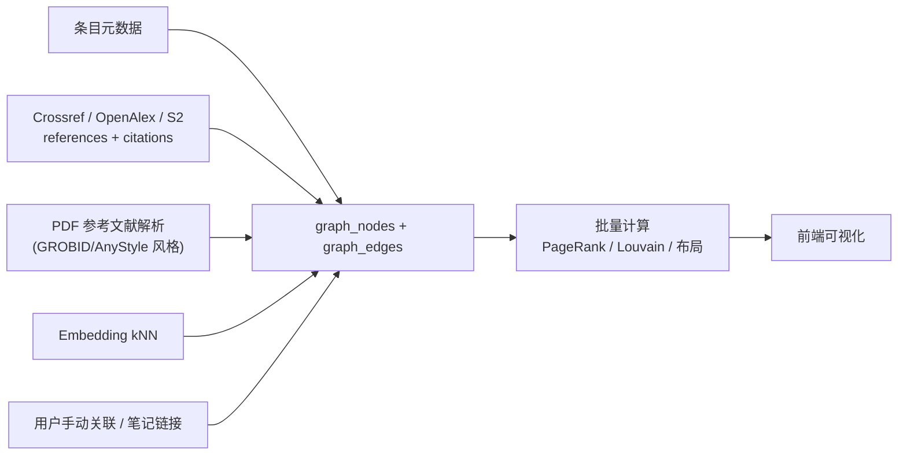

# 13 · 文献关系图谱

## 1. 目标

把"一堆条目"变成"一张有结构的知识网络"，回答四类问题：

| 问题 | 视图 |
| --- | --- |
| 这个领域是怎么演化过来的？ | **引文时间轴**（按年份分层的 DAG） |
| 这篇论文的知识谱系？谁引它、它引谁？ | **自我中心网络**（ego network，1–2 跳） |
| 我的库分成哪几个主题簇？哪个簇我读得少？ | **主题聚类地图**（社区发现 / embedding 降维） |
| 谁是这个方向的核心人物 / 核心论文？ | **中心性排行**（PageRank / 中介中心性） + 合作网络 |

## 2. 图模型

### 2.1 节点

| 类型 | 说明 |
| --- | --- |
| `item` | 库内文献（有 `itemKey`） |
| `external` | 库外文献（只有 DOI/OpenAlexID，来自引文关系；用虚线/灰色渲染，可一键入库 ⭐） |
| `author` | 作者（带 ORCID 消歧） |
| `venue` | 期刊/会议 |
| `tag` / `concept` | 标签与主题概念（OpenAlex concepts / 自建主题模型） |
| `note` | 笔记（笔记里 `@` 引用的条目形成边） |

> **库外节点非常重要**：它让图谱能显示"你缺了哪些关键文献"—— 一个被库内 10 篇论文共同引用、但你没有的节点，几乎必然是必读文献。点击即可通过 Discovery Agent 入库。

### 2.2 边

| 边类型 | 方向 | 权重 | 来源 |
| --- | --- | --- | --- |
| `cites` | 有向 | 1 | Crossref / OpenAlex / S2 / PDF 参考文献解析 |
| `cocitation` | 无向 | 共同引用它们的文献数 | 计算得出 |
| `coupling`（文献耦合） | 无向 | 共同参考文献数 | 计算得出 |
| `similar` | 无向 | cosine 相似度 | embedding kNN |
| `authored_by` | item→author | 1 | 元数据 |
| `coauthor` | 无向 | 合作次数 | 计算得出 |
| `published_in` | item→venue | 1 | 元数据 |
| `tagged` | item→tag | 1 | 标签 |
| `related` | 无向 | 1 | 用户手动关联（`relations` 表） |
| `mentions` | note→item | 1 | 笔记链接 |

### 2.3 存储

```sql
CREATE TABLE graph_nodes (
  id          INTEGER PRIMARY KEY,
  library_id  INTEGER NOT NULL,
  kind        TEXT NOT NULL,          -- item|external|author|venue|concept|note
  item_id     INTEGER REFERENCES items(id) ON DELETE CASCADE,  -- kind=item 时
  ext_id      TEXT,                   -- doi:10.x / openalex:W123 / orcid:0000-…
  label       TEXT NOT NULL,
  year        INTEGER,
  meta        TEXT,                   -- JSON：作者、期刊、被引数等展示用字段
  UNIQUE (library_id, kind, ext_id)
);
CREATE INDEX idx_gn_item ON graph_nodes(item_id);

CREATE TABLE graph_edges (
  src        INTEGER NOT NULL REFERENCES graph_nodes(id) ON DELETE CASCADE,
  dst        INTEGER NOT NULL REFERENCES graph_nodes(id) ON DELETE CASCADE,
  kind       TEXT NOT NULL,
  weight     REAL NOT NULL DEFAULT 1,
  source     TEXT NOT NULL,           -- crossref|openalex|s2|pdf-parse|user|computed
  confidence REAL NOT NULL DEFAULT 1, -- PDF 解析出的边置信度低
  PRIMARY KEY (src, dst, kind)
) WITHOUT ROWID;
CREATE INDEX idx_ge_dst ON graph_edges(dst, kind);

CREATE TABLE graph_metrics (          -- 定期批量计算，避免实时算
  node_id    INTEGER PRIMARY KEY REFERENCES graph_nodes(id) ON DELETE CASCADE,
  degree_in  INTEGER, degree_out INTEGER,
  pagerank   REAL,
  betweenness REAL,
  community  INTEGER,                 -- Louvain 社区号
  x REAL, y REAL,                     -- 服务端预计算的布局坐标
  updated_at INTEGER
);
```

**不引入图数据库**。规模估算：10 万条目 × 平均 30 条参考文献 ≈ 300 万边，SQLite 存下来约 200MB，全图载入内存用 `petgraph` 计算耗时秒级 —— 完全够用，且保持"单文件、零运维"的产品承诺。

## 3. 数据来源与构建



- **拉取策略**：入库时后台异步拉取该文献的 references/citations（限速、缓存、可离线跳过）。库外节点只存轻量元数据。
- **实体消歧**：DOI 优先；无 DOI 时用 `归一化标题 + 首作者 + 年份` 指纹；作者用 ORCID > (姓名 + 机构 + 领域) 聚类。中文作者重名严重，额外用共同作者网络辅助消歧。
- **增量**：新条目入库 → 只计算与已有图的连接，不重建全图；`pagerank`/`community` 每 N 次变更或每日重算一次。
- **离线可用**：没有网络时，图谱退化为「基于本地元数据 + PDF 解析 + embedding」的版本，仍可用。

## 4. 计算

| 算法 | 用途 | 实现 |
| --- | --- | --- |
| PageRank | 找核心文献 | `petgraph` + 自研幂迭代 |
| Louvain / Leiden | 主题社区发现 | Rust 实现（社区数 → 自动命名：取簇内高频概念 + LLM 起名） |
| 中介中心性（近似） | 找"桥梁"论文（连接两个领域） | Brandes 采样近似 |
| 最短路径 | "从 A 到 B 的引文路径"，讲清楚思想传承 | BFS/Dijkstra |
| ForceAtlas2 / OpenOrd | 布局 | 节点 > 5000 时**服务端预计算**存 `graph_metrics.x/y`；小图前端 Worker 实时布局 |
| UMAP（可选） | embedding 二维投影 → "主题地图" | `fastembed` + 轻量 UMAP 实现，或 t-SNE 替代 |

## 5. 前端可视化

**选型：`graphology`（图数据结构）+ `sigma.js`（WebGL 渲染）+ `graphology-layout-forceatlas2`（Web Worker）**
理由：sigma.js 在 WebGL 下可流畅渲染万级节点，且与 graphology 生态（布局、度量）无缝；D3 力导向在 2000 节点以上就卡。

### 5.1 交互设计

```
┌────────────────────────────── 图谱视图 ─────────────────────────────┐
│ [视图: 引文网络▾] [范围: 项目《综述》▾] [布局: 力导向▾] [🔍搜索]      │
│ ┌─ 侧栏 ────┐ ┌──────────── 画布 ───────────────┐ ┌─ 详情 ──────┐ │
│ │边类型开关  │ │   ●━━━▶●                        │ │ 选中节点     │ │
│ │ ☑ 引用     │ │  ╱      ╲                       │ │ 标题/作者    │ │
│ │ ☑ 共被引   │ │ ●   ◌ ← 库外节点(虚线)          │ │ PageRank #7 │ │
│ │ ☐ 语义相似 │ │  ╲      ╱                       │ │ [打开]      │ │
│ │节点着色    │ │   ●━━━▶●                        │ │ [加入库]⭐  │ │
│ │ ○社区 ●年份│ │                                 │ │ [以此为中心]│ │
│ │ ○阅读状态  │ │  时间轴 ◀━━━━━━━━━━━▶ 2015—2026 │ │ [问 Agent] │ │
│ └───────────┘ └─────────────────────────────────┘ └────────────┘ │
└────────────────────────────────────────────────────────────────────┘
```

- **渐进披露**：默认只画 `cites` 边 + 库内节点；用户按需打开共被引、语义相似、库外节点。一次性全画必然变成"毛球图"（hairball），是所有图谱功能失败的主因。
- **节点大小** = PageRank 或被引数；**颜色** = 社区 / 年份 / 阅读状态 / 项目章节；**虚线圈** = 库外文献。
- **聚焦模式**：双击节点 → 只保留其 1–2 跳邻域，其余淡出。
- **时间轴刷选**：拖动年份区间，图动态过滤，看领域演化。
- **框选 → 批量操作**：选中一个簇 → 「全部加入项目」/「让 Agent 解释这个簇」/「导出 bib」。
- **性能**：节点 > 3000 时自动切"聚合模式"（按社区折叠成超级节点，展开才细化）；坐标走服务端预计算；渲染走 WebGL；数据用二进制/紧凑 JSON 传输。

### 5.2 与 Agent 联动

| 图上操作 | Agent 行为 |
| --- | --- |
| 选中一个社区 → "解释" | Library Agent 读该簇文献，输出主题概括 + 代表作 + 演化脉络 |
| 选中两个节点 → "它们什么关系" | 找引文路径 + 精读 + 说明思想传承或分歧 |
| "找出我的盲区" | 统计高入度的库外节点 → Discovery Agent 补齐 → 进收件箱 |
| 选中节点 → "找最新跟进" | Discovery Agent 拉该文的 citations 并按时间/质量排序 |

## 6. API

```
GET  /api/v1/libraries/{lib}/graph
     ?scope=collection:QWERTY12|project:3|smart:K1|items:A,B,C|all
     &edges=cites,cocitation           # 边类型开关
     &includeExternal=true&minDegree=2 # 库外节点过滤
     &layout=precomputed|none
     &maxNodes=3000
     → { nodes:[{id,kind,label,year,x,y,pagerank,community,itemKey?}],
         edges:[{s,d,k,w}], stats:{...}, truncated:false }

GET  /api/v1/items/{key}/graph/ego?depth=2&direction=both
GET  /api/v1/graph/path?from=&to=
GET  /api/v1/libraries/{lib}/graph/communities        → [{id, label, size, topItems[], topConcepts[]}]
GET  /api/v1/libraries/{lib}/graph/gaps               → 高入度的库外文献（"你缺的关键文献"）
POST /api/v1/libraries/{lib}/graph/rebuild            → 异步重算（taskId）
POST /api/v1/graph/nodes/{id}/import                  → 库外节点一键入库
GET  /api/v1/libraries/{lib}/graph/export?format=graphml|gexf|json|csv
```
支持导出 GraphML/GEXF，方便用户拿去 Gephi / VOSviewer 做深度分析 —— **不锁死用户数据**。

---

## 附：第一版实现说明（与本设计的差异，及理由）

本设计提出把图物化到 `graph_nodes` / `graph_edges` / `graph_metrics` 三张表里。
**第一版没有这么做**，而是把邻域做成一次查询。理由值得写下来：

本设计里的边分两类。`cites` / `cocitation` / `coupling` 来自库外（Crossref、
OpenAlex、PDF 解析），是**外部事实**，必须有地方存——这类边出现时，物化就是对的。
而今天这个库真正能算出来的边——共享标签、同一作者、同一收藏夹、语义相近——
**每一条都已经被条目本身蕴含**。把它们物化出来就是一份缓存，而一份可以和源头
不一致的缓存，比没有更糟：图看起来是权威的，读者不会怀疑它。

所以第一版的取舍是：

- **图是查询，不是表。** 没有失效逻辑，也就没有"图和列表说的不一样"这种 bug。
- **永远是邻域，不是全库。** 十万个节点不是图，是一张灰色圆盘。
- **每条边都必须能解释自己**（`relation` 字段）。无法解释的边是要求读者盲信的断言。
- **过于常见的标签不产生边。** `to-read` 打在四千条上，不说明这四千条相关，
  只说明它们没读。这既是性能护栏（一个热门标签能让 join 扫掉大半张 `item_tags`），
  更是正确性：否则图会被毫无意义的边填满。
- **只用首作者**（`sort_creator` 有索引，是查找而非扫描）。完整合作网络需要
  creators 表；为一个还没人问过的问题去造表，是 schema 腐坏的开始。

等引文数据真正接进来时，再按本设计物化——那时物化才有它必须存在的理由。

### 引文边已经接进来了（`item_relations`）

分界线就是上面那条：**库自身蕴含的边靠查询推导，外部世界告诉你的事实必须存下来。**
参考文献来自出版商，它成立与否和这两篇论文在不在你库里毫无关系，所以它没有别的
地方可存。

三个具体取舍：

- **被引作品用 fingerprint 寻址，不用外键。** 大多数被引论文根本不在库里，外键指不了
  一篇没人拥有的论文。而且 fingerprint（`doi:…`）和 `Item::fingerprint` 是同一种形状，
  已经有索引。
- **解析发生在读图的时候，不是写入的时候。** 于是以后把被引论文加进库，那条边**自己**
  就变成了内部边——不需要回填，没有会过期的东西，也不存在"库里明明两篇都有、图上却
  画成陌生人"的时间窗。
- **库外节点照画不误，而且那正是价值所在。** 一篇被你书架上好几篇论文共同引用、你却
  一篇没有的文献，几乎按定义就是下一篇该读的。它画成虚线空心，因为点它打不开任何东西
  ——图应该在点击之前就说明这一点。


### 「必读缺口」的性能：一次尚未完成的修复（实测记录）

在一个 10 万条目、**180 万条引文**的库上实测（服务器同款 PRAGMA：64 MiB 页缓存 + mmap）：

| 查询形状 | 耗时 |
| --- | --- |
| 最初的写法（聚合内部逐行做"是否已拥有"关联子查询） | **> 10 分钟未返回** |
| 仅按索引聚合 `GROUP BY target_key` | 559 ms |
| 聚合后再对**分组**做反连接（当前实现） | 2.8 s |
| 同上再加 `max(target_label)` 进聚合 | 10.7 s |

两条教训已经写进代码注释：

1. **聚合里的每一样东西都要付 180 万次。** "是否已拥有"必须对 40 万个**分组**做，
   而不是对 180 万**行**做——同一个谓词，位置不同，差了两个数量级以上。
2. **标签不要放进聚合。** `max(target_label)` 会为每条引文读一次表行，单独就要 6 秒；
   改成对幸存下来的 50 行事后补取。

**但 2.8 秒对一个页面来说仍然不可接受。** 真正的解法是把这个计数**增量维护**：
一张 `cited_works(target_key, label, year, doi, citations)` 表，在写入引文的**同一个事务里**
更新——和检索索引的做法完全一致，因此不存在"计数和事实打架"的可能。届时
`missing()` 会退化成一次按 `citations DESC` 的索引扫描加少量反连接查找。

这不是"以后有空再说"，而是这个功能在真实规模下能否使用的前提。

### 后续：做完了，而且真凶不是聚合

`cited_works` 已经落地，计数在写入引文的**同一个事务**里维护（这也是本项目唯一允许
存在的派生表：它和检索索引一样，写在源头旁边，因而**不可能**与源头不一致）。

但把维护好的表接上去之后，**第一次测量反而更慢了：8.8 秒**。分段量出来真凶完全不在
聚合上：

| 步骤 | 耗时 |
| --- | --- |
| 按排名取前 220（纯索引） | **0.1 ms** |
| 加上"是否已拥有"的反连接 | **8.9 s** |
| 每个候选的"回收站修正" | 0.3 ms |

看执行计划才明白：反连接用的是 `idx_items_year`——一个 `(library_id, deleted, …)` 的
索引——匹配完 library 和 deleted 之后，**再扫十万行**去找 fingerprint，每个候选扫一次。

指名 `INDEXED BY idx_items_fingerprint` 之后：**8.5 秒 → 0.2 毫秒**（四万倍）。

**教训（与 CROSS JOIN 那次同一类）**：规划器会挑一个看起来合理、实际灾难性的索引，
而返回的行**一模一样**。这类回归只有断言执行计划能守住，所以 `MISSING_SQL`
提取成常量并配了计划测试。

端到端：最初的写法**十分钟不返回** → 重构查询后 2.8 秒 → 现在 **17 毫秒**。

## 文献耦合（bibliographic coupling）

引用了相同参考文献的两篇论文，多半在做同一个问题——不管有没有人给它们打过一样的标签。
这是图谱里**唯一不由文献库自身蕴含**的边：它来自参考文献列表，是世界给的事实。

两条守门规则，和标签边同源：

- **被超过 50 篇论文引用的参考文献不连边**。一个领域里每篇论文都引它的奠基之作，
  由此画出的边是"所有东西连所有东西"。
- **至少共享 2 条参考文献**。共享 1 条是巧合——同领域的两篇论文会共同引用一篇综述，
  但它们不见得在谈同一件事。

只匹配**出版方给了标识符**的参考文献。没有 DOI 的条目只能靠标签文字匹配，而两份参考文献
列表极少用同样的写法拼写同一篇论文——在错拼上连边，是"言之凿凿的错误"，比缺一条边更糟。

实测（180 万条引文）：耦合查询本身 1.1ms。

## 又一次同样的索引陷阱：1585ms → 0.14ms

实现耦合时顺带发现 `cites`（读一篇论文的参考文献并解析出库内条目）要 **1585ms**。
原因和 `MISSING_SQL` 一模一样：planner 给指纹 LEFT JOIN 选了 `idx_items_year`
——一个匹配全库的谓词——于是**每条参考文献都扫一遍全库**。30 行结果，四个数量级的差距，
结果完全相同，所有只检查返回值的测试自始至终都是绿的。

`INDEXED BY idx_items_fingerprint` 之后 0.14ms，整个图谱端点从 1.3s 降到 17ms。

结论重申：**同一张表、同一个列、同一个陷阱，已经踩了两次**。凡是按 fingerprint 关联
`items` 的查询，都要写计划断言。

## 共被引（co-citation）

耦合的镜像。**耦合看两篇论文向后指向什么**——它在论文发表那天就固定了；
**共被引看谁向前同时指向它们**——它随着一个领域逐渐把两篇论文放在一起读而增长。

"引用了这篇的人还引用了什么"，和"这篇引用了哪些相同的东西"是两个不同的推荐，
而且往往前者更有用。

前提是这篇论文**有标识符**：参考文献列表只能靠标识符指认一篇论文。没有 DOI 的条目
只能靠标题匹配，而那会时不时指错人——所以直接返回空，比给一个有时是错的答案好。

同样要求至少 2 篇论文同时引用两者：一篇论文同时引用它们，那只是一份参考文献列表，不是模式。

## 测试用的指纹必须是真指纹

写共被引测试时踩到：辅助函数里写的是 `format!("doi:{doi}")`，而真实代码
（`Resolved::fingerprint` 和 `Item::fingerprint`）都会先 `normalize` 一遍
（`10.1/focus` → `doi:10 1 focus`）。于是查询匹配不到任何东西，看起来像功能坏了。

顺带发现：**之前的耦合测试用不规范的指纹也能通过**——因为耦合只比对 `target_key` 之间，
从不接触条目指纹。也就是说那组测试比它看起来的要弱。现在两边都用真实格式。

教训与 3.10（fixture 从类型抄出来等于什么都没测）同源：**fixture 里的值必须是生产环境
真会出现的值**，形状对不代表内容对。

## 引文可以录入，不只能抓取

在此之前，参考文献**只能**从 Crossref 抓来。这意味着：离线用不了、Crossref 覆盖差的领域
用不了、手上已经有 `.bib` 的人也用不了——而抓取只是个便利，事实本身才是重点。

`PUT /libraries/:lib/items/:key/citations` 录入一份参考文献。两个要点：
- **替换而非合并**，和 `set_citations` 同理：一份参考文献列表属于一篇印出来的论文，
  把两个版本合起来，得到的列表哪一版都不匹配。
- 指纹在服务端**统一 normalize**。让调用方自己拼 `doi:...` 是把一个必错的细节交出去——
  我自己在测试 fixture 里就拼错过一次（见 13 节末尾）。

顺带：这个接口让"共被引"第一次能在真实 HTTP 路径上做冒烟检查。但这不是加它的理由——
为测试而加接口是错的，**为离线可用而加、顺便可测**才是对的。

## 引文终于有了阅读的地方

数据从落库那天起就被图谱用着，却没有任何界面能平铺直叙地看它——于是最直接的问题
"这篇引用了什么、其中哪些我有"在界面上没有答案。现在详情面板里有了：
库中持有的连成链接，没有的就显示出版方印的那行标签。**两种情况都不特殊**，这正是要点。


## 标签筛选：一次**刻意不做**的优化（实测记录）

`list filtered by tag` 是基准里最慢的一条（13 万条库、2.8 万条命中：页 29ms + 计数 14ms）。
执行计划是"从标签成员驱动，再临时排序"。换成"按排序索引驱动、边读边过滤"快得多——
**但只对常见标签**：

| 标签规模 | 成员驱动（现状） | 顺序驱动 |
|---|---|---|
| 28675 条（22%） | 32.3ms | **5.1ms** |
| 4434 条（3.4%） | 5.4ms | **1.2ms** |
| **5 条（0.004%）** | **0.06ms** | **12.06ms** |

稀有标签上顺序驱动要把整个库按日期扫一遍才凑够一页，慢 **200 倍**。

关键在于**标签是绑定参数**，一条语句只能有一个计划，`stat4` 也无法按值特化
（重跑 `ANALYZE` 之后两种规模仍是同一个计划）。所以现状的成员驱动是唯一
**不会灾难化**的通用选择：最坏情况是排序 N 个成员，而 N 本身就是命中数。

要更快就得按选择性分流（"这个标签有多大"可以用 0.96ms 查到）。**暂不做**，理由是
收益（47→约 20ms，且已在预算内）不抵新增第二套查询形状的风险——尤其是在
刚刚因为一次计划变动付出 7 倍回归的代价之后（`docs/16` §3.84）。

留给后来者：要做的话，判据是 `命中数 / 库内条目数`，阈值取 5% 左右
（顺序驱动约需读 `库大小 / 命中数 × limit` 行），并且两条路径都要有计划断言。
